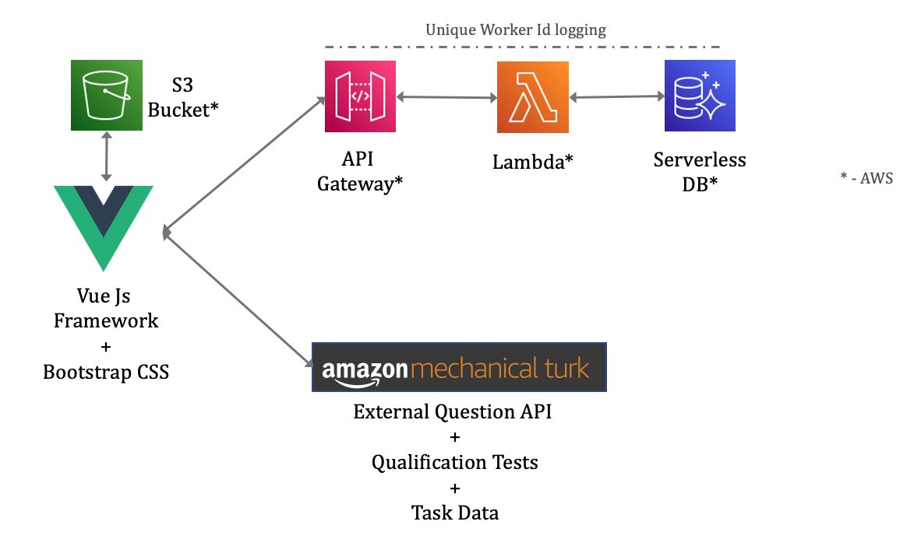

# Crowd-Eval-Audio Framework Serverless Setup

Note: Setting this up is optional. To be setup only if your experiments follow a between-subjects design and you need unique responses across HITs. 

A frontend focused framework to setup and conduct perceptual listening tests on crowdsourced platforms such as Amazon's Mechanical Turk.  

The web interface uses an API fronted by AWS Gateway routed to a Lambda. It also uses a Aurora serverless Http Data API enabled DB. The technology stack looks something like in the image below. We use this API to enable worker id logging, to enable Between-Groups experiments (where we need ensure unique participation in our online experiments)

<p align="center">
  
</p>
  
We follow a very simple AWS setup as outlined in some of the tutorials below. The tutorial links below are what worked for this project and outlined here for posterity.

Generally to host an API, we follow the steps below -   
1. [Create Aurora Serverless DB](#aurora-serverless-db)  
2. [Build and deploy Lambda and AWS Gateway endpoints](#build-and-deploy-lambda)
3. [Create endpoints using AWS Gateway](#pass-http-request-parameters-via-gateway)

## Directory Structure
The directories under ```./serverless``` are as follows - 
* [db/](./db) # DB create scripts. For now, its just one simple table.
* [lambda/](./lambda) # Lambda using Node.js. Currently there are 3 main APIs - to save worker id, check if worker id exists and another which combines both. Use which one suits your requirement (or create a new one).  

## Aurora Serverless DB

Create the DB based on this [Aurora Serverless DB tutorial](https://aws.amazon.com/getting-started/hands-on/building-serverless-applications-with-amazon-aurora-serverless/). 

Dont forget to enable 'Data API' (step 1.15 in the tutorial). Run the scripts under [db/](./db) in the query editor.

## Build and deploy lambda

Refer to this tutorial for creating a lambda and enable Gateway API - [Create Lambda and API Gateway (Nodejs) — AWS Serverless to RDS MySQL](https://medium.com/@hk_it_er/create-lambda-and-api-gateway-nodejs-aws-serverless-to-rds-mysql-6a75243e61cc)

Use the lambda scripts under the [lambda/](./lambda/) directory.

## Pass HTTP request parameters via Gateway

Refer to this tutorial - [Pass Api Gateway Query Parameters to AWS Lambda](https://bobbyhadz.com/blog/aws-apigateway-pass-query-parameters-lambda)


